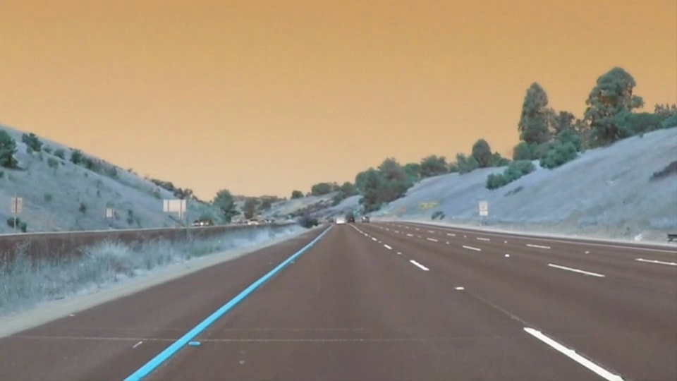
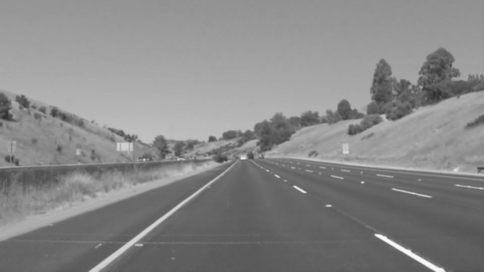
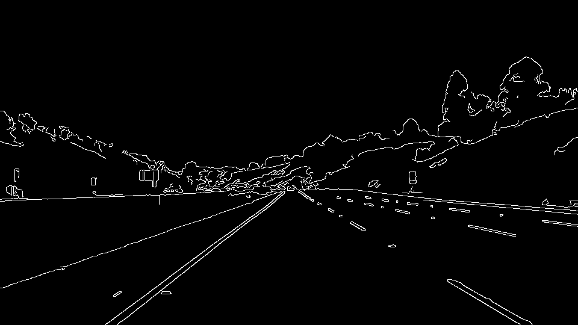
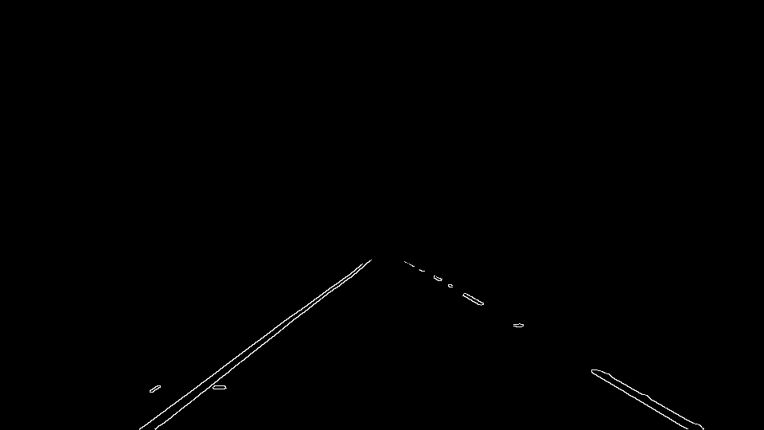
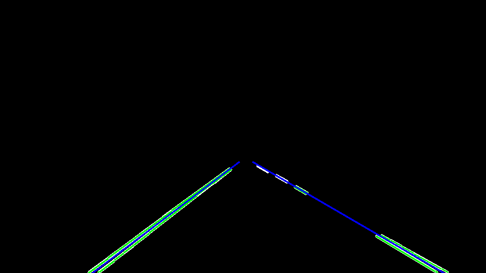
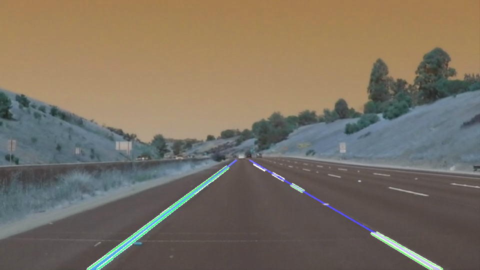

# **Finding Lane Lines on the Road** 

## Writeup Template

### You can use this file as a template for your writeup if you want to submit it as a markdown file. But feel free to use some other method and submit a pdf if you prefer.

---

**Finding Lane Lines on the Road**

The goals / steps of this project are the following:
* Make a pipeline that finds lane lines on the road
* Reflect on your work in a written report

---

### Reflection

### 1. Describe your pipeline. As part of the description, explain how you modified the draw_lines() function.

My pipeline consisted of 5 steps as below

  1. Set Gaussian blur parameter and apply
   - Input : img_original 
   - Tune Param. : kernel_size (=3)
   - Helper Function : gaussian_blur(grayscale(img_original),kernel_size)
   - Output : img_gray
   
   2. Set Canny edge parameter and apply
   - Input : img_gray 
   - Tune Param. : low_threshold (=50), high_threshold (=150)
   - Helper Function : canny(img_gray, low_threshold, high_threshold)
   - Output : img_canny
   
   3. Set interest region polygon and apply
   - Input : img_canny 
   - Tune Param. : y_init (=320), y_end (imshape[0]), vertices([(0,y_end),(480, y_init), (490, y_init), (imshape[1],y_end)]])
   - Helper Function : region_of_interest(img_canny, vertices)
   - Output : img_interset 
   
   4. Set hough_lines parameter and apply
   - Input : img_interset 
   - Tune Param. : rho (=1), theta (=pi/180), threshold (=10), min_line_len (=20), max_line_gap (=10)
   - Helper Function : img_hough = hough_lines(img_interset, rho, theta, threshold, min_line_len, max_line_gap, y_init, y_end)
   - Output : img_hough 
   
   - modified draw_lines()
     : In order to draw a single line on the left and right lanes, I modified the draw_lines()
       function as below
      
       seperate each line point and stack (each stack size is 30)
        -> x1 < 450 : [x1,x2] extend to left x stack [y1,y2] extend to left y stack
           x1 > 550 : [x1,x2] extend to right x stack [y1,y2] right to left y stack
           
       1st order polynomial fitting using stacked point
        -> poly_left = np.polyfit(left_y, left_x, 1)
           poly_right = np.polyfit(right_y, right_x, 1)
           
       extrapolating on [y_init, y_end]
        -> poly_x_init_left, poly_x_end_left = np.polyval(poly_left,[y_init, y_end])
           poly_x_init_right, poly_x_end_right = np.polyval(poly_right,[y_init, y_end])
           
       drawing the line based on initial poind and end point
       
       
       *it is more robust than non-stacked case
       

   5. Draw the lines on the edge image and wirte
   - Input : img_hough, img_original
   - Tune Param. : helper function default setting
   - Helper Function : weighted_img(img_hough, img_original, α=0.8, β=1., γ=0.)
   - Output : img_add 
      

If you'd like to include images to show how the pipeline works, here is how to include an image: 

 

 

### 2. Identify potential shortcomings with your current pipeline

One potential shortcoming would be what would happen when ... 

Another shortcoming could be ...

### 3. Suggest possible improvements to your pipeline

A possible improvement would be to ..zzzzzzzzzzzzzzz
Another potential improvement could be to ...
